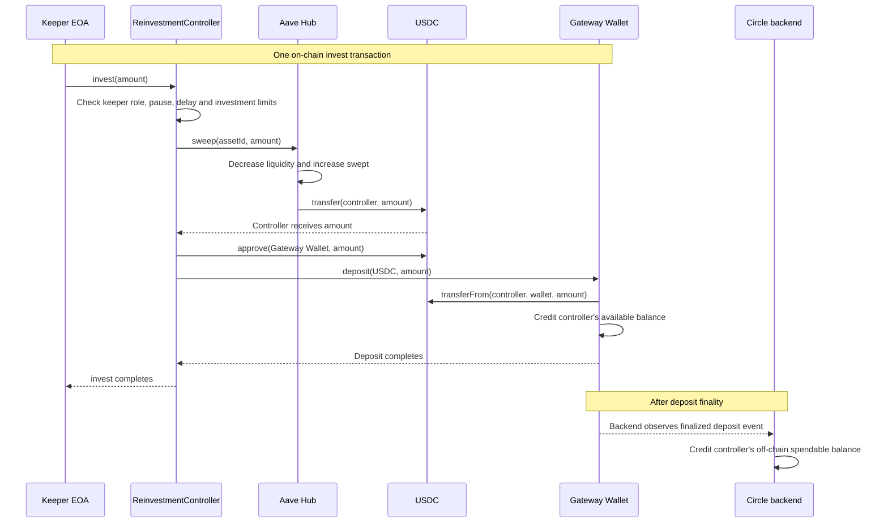
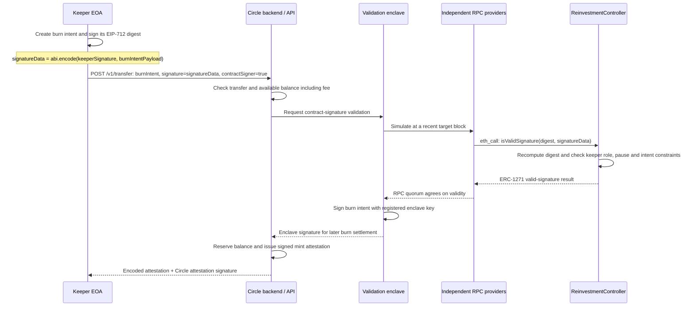
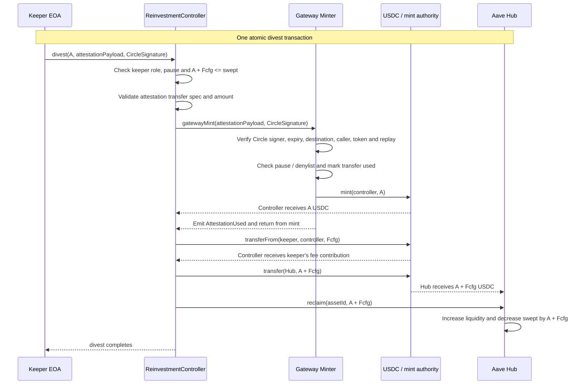
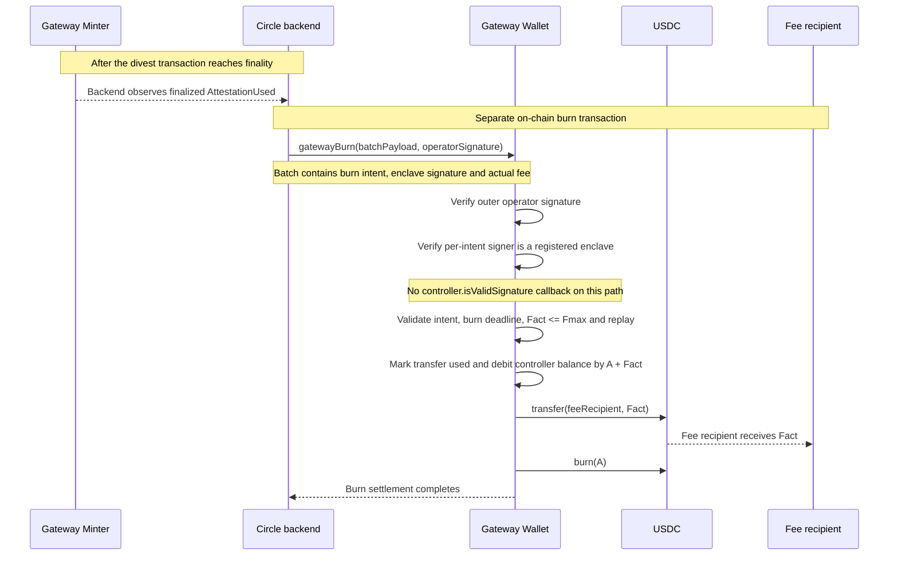

# ReinvestmentController architecture

ReinvestmentController moves idle USDC from an Aave Hub into Circle Gateway and returns liquidity to the Hub through same-chain mint-and-burn transfers. The controller owns the Gateway deposit; keepers execute operations and sign transfer authorizations on its behalf.

The diagrams describe successful investment and divestment using Circle's documented enclave-based ERC-1271 authorization. Deployment requires a Gateway Wallet and backend that support this settlement path. Gateway versions using direct ERC-1271 callbacks have different authorization requirements, described under [Settlement compatibility](#settlement-compatibility).

## Components

| Component              | Responsibility                                                                                             |
| ---------------------- | ---------------------------------------------------------------------------------------------------------- |
| Aave Hub               | Holds protocol liquidity and tracks `swept`, the assets allocated to the controller and not yet reclaimed. |
| ReinvestmentController | Enforces investment limits, validates keeper authorizations, and moves funds between the Hub and Gateway.  |
| Keeper EOA             | Calls `invest()` and `divest()`, signs burn intents, and funds the configured divestment fee contribution. |
| Gateway Wallet         | Holds the controller's deposited USDC and executes source-side debits, fees, and burns.                    |
| Gateway Minter         | Verifies Circle attestations and mints USDC to the controller.                                             |
| Circle backend         | Tracks finalized deposits and reserved balances, issues attestations, and submits settlement transactions. |
| Validation enclave     | Validates ERC-1271 authorization using an independent RPC quorum and signs burn intents for settlement.    |

## 1. Investment

`invest(amount)` transfers USDC from the Hub to the Gateway Wallet in one atomic transaction. Circle credits its off-chain balance ledger after the deposit reaches finality.

The deposit is authorized by the keeper's transaction and the controller's token allowance. It does not require an attestation.

## 2. Transfer authorization

Before divestment, the keeper requests a mint attestation from Circle. It signs a burn intent using EIP-712 and includes the encoded intent alongside its signature in the controller's custom ERC-1271 signature data. The enclave validates this authorization against recent blockchain state and signs the burn intent for subsequent settlement.

ERC-1271 validation is a read-only RPC simulation. Circle documents a quorum of at least two of three independent RPC providers. The diagram shows the backend's logical responsibilities, rather than its internal scheduling.

The controller requires the same source and destination chain. The transfer specification's depositor, source signer, destination recipient, and permitted destination caller must all be the controller address.

### Authorization messages

| Message                | Contents                                                                                                              | Purpose                                                   |
| ---------------------- | --------------------------------------------------------------------------------------------------------------------- | --------------------------------------------------------- |
| Transfer specification | Source and destination domains, contracts, tokens, depositor, recipient, signer, caller, amount, salt, and hook data. | Identifies the transfer shared by its mint and burn.      |
| Burn intent            | Transfer specification, source-chain expiry block, and maximum fee.                                                   | Authorizes debiting the Gateway deposit.                  |
| Attestation            | Transfer specification and destination-chain expiry block.                                                            | Authorizes minting the specified amount to the recipient. |

Signatures are supplied separately from these message structures.

| Signature                  | Signer                        | Verification                                                                                         |
| -------------------------- | ----------------------------- | ---------------------------------------------------------------------------------------------------- |
| Keeper signature           | Keeper EOA                    | The controller checks the signature, keeper role, and intent constraints during ERC-1271 validation. |
| Attestation signature      | Circle attestation signer     | The Gateway Minter checks mint authorization. This signature is passed to `divest()`.                |
| Enclave signature          | Registered validation enclave | The Gateway Wallet checks burn authorization without repeating the controller callback.              |
| Outer burn-batch signature | Circle burn operator          | The Gateway Wallet checks authorization for the submitted batch of intents, signatures, and fees.    |

## 3. Divestment

`divest()` consumes the attestation, receives newly minted USDC, and returns liquidity to the Hub in one atomic transaction. Let `A` be the mint amount and `Fcfg` the controller's configured `maxFee`. The keeper supplies `Fcfg` from its own USDC balance and must grant the controller sufficient allowance beforehand.

The controller returns and reclaims `A + Fcfg`. A failure at any step reverts the entire transaction, including the mint and its event. The source-side Gateway deposit remains unchanged until settlement.

## 4. Burn settlement

After observing the finalized `AttestationUsed` event, Circle submits a separate burn transaction. The Gateway Wallet validates the enclave's signature, debits the controller's deposit, pays the fee, and burns the principal. `Fact` is the actual fee, capped by the burn intent's signed maximum `Fmax`.

The diagram assumes sufficient deposited funds to cover the principal and fee. Minting and burning are separate transactions coordinated by Circle's backend.

## Fee accounting

| Value  | Meaning                                                                                                        |
| ------ | -------------------------------------------------------------------------------------------------------------- |
| `A`    | USDC minted to the controller. The Gateway fee is not subtracted from this amount.                             |
| `Fcfg` | Controller's configured `maxFee`, pulled from the keeper during divest.                                        |
| `Fmax` | Maximum fee authorized in the signed burn intent. Controller checks `Fmax <= Fcfg` when validating the intent. |
| `Fact` | Fee supplied during burn settlement. Gateway checks `Fact <= Fmax`.                                            |

For example, with **100 USDC deposited**, `A = 99` and all three fee values equal to `1`:

- Divest mints **99**, pulls **1** from the keeper, and returns/reclaims **100** at the Hub.
- Later settlement debits **100** from the Gateway balance: **99 burned**, **1 paid as fee**.

## Transaction and trust boundaries

- Investment and divestment each execute atomically on-chain. Attestation issuance and burn submission are separate backend operations.
- The Minter relies on Circle's attestation signature for authorization; it does not verify the source deposit balance or completion of the burn.
- Enclave-based settlement relies on the validation service's request-time ERC-1271 check, RPC quorum, and registered signing key. Subsequent controller state changes do not trigger another ERC-1271 check on this path.
- Gateway's contract configuration, token support, pause controls, and upgrades remain external dependencies of the controller.

## Settlement compatibility

Gateway supports distinct contract-authorization paths. Their signature formats and validation timing must match the integration's backend configuration.

| Path                        | Burn-time behavior                                                                                   | Controller requirement                                                 |
| --------------------------- | ---------------------------------------------------------------------------------------------------- | ---------------------------------------------------------------------- |
| Enclave authorization       | Accepts a registered enclave's signature over the burn intent, without calling the controller again. | Authorization must pass the validation service's request-time check.   |
| Direct allowlisted ERC-1271 | Calls the controller with the original custom signature data during the burn.                        | Authorization must remain valid after divestment and until settlement. |

The repository's pinned Gateway implementation recognizes enclave signatures before falling back to the direct callback path. Confirm the deployed implementation and backend path when configuring an integration or its tests.

The controller's validation reads mutable state, including `swept`. Direct callback settlement can therefore reject a previously accepted intent after `divest()` reduces `swept`. Enclave-based settlement avoids that repeated check.

## Sources

- [Controller invest and divest](src/ReinvestmentController.sol)
- [Pinned Gateway enclave and direct signature-validation paths](lib/evm-gateway-contracts/src/modules/wallet/Burns.sol)
- [Circle: Gateway system inputs and finality](https://developers.circle.com/gateway/references/technical-guide#inputs)
- [Circle: ERC-1271 validation and enclave-based burn settlement](https://developers.circle.com/gateway/references/erc-1271#how-erc-1271-validation-works)
- [Current upstream Gateway: enclave signature path before direct ERC-1271 fallback](https://github.com/circlefin/evm-gateway-contracts/blob/master/src/modules/wallet/Burns.sol#L316)
